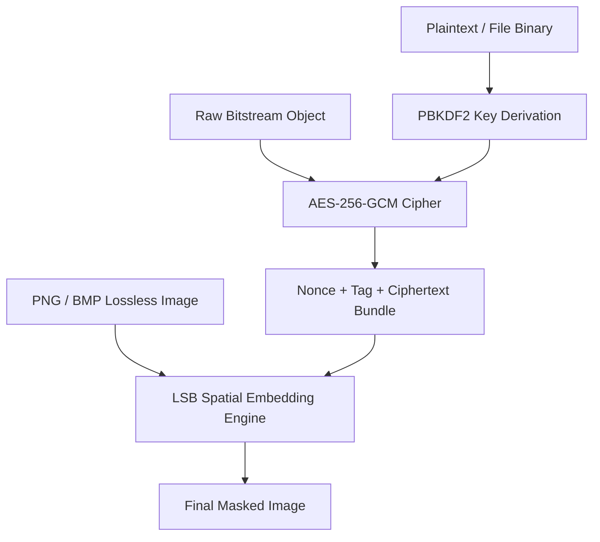

# MaskedBit 🎭

Link: https://maskedbit.streamlit.app/

**MaskedBit** is a production-grade, privacy-focused security tool that bridges the gap between cryptography and spatial steganography. Built with Python and Streamlit, the system implements an end-to-end processing pipeline that encrypts sensitive payloads (text data or nested asset files) using **AES-256-GCM (Galois/Counter Mode)** before safely embedding them into the Least Significant Bits (LSB) of lossless image pixel matrices.

The application executes entirely on the client side, meaning zero data persistence, minimal transmission overhead, and verifiable privacy boundaries.

---

## 🚀 Core Engineering Highlights

* **Authenticated Symmetric Cryptography:** Implements industrial-strength `AES-256-GCM`. Provides multi-layered defense—achieving both *confidentiality* via bit encryption and *integrity/authenticity* through cryptographic message tags, neutralizing payload bit-flipping attacks entirely.
* **Polymorphic Payload Encoding:** Supports dual-mode steganographic hiding. The core engine dynamically handles abstract bitstream serialization, allowing users to conceal raw text messages or encapsulate distinct file binaries (e.g., identity documents, certificates) inside a separate, benign cover image.
* **Predictive Capacity & Risk Analytics Engine:** Prioritizes carrier structural integrity. The application programmatically evaluates spatial boundaries before writing to memory, parsing dimensional byte limits ($W \times H \times \text{Channels}$) against total encrypted bit arrays (inclusive of nonces and signature metadata tags) to flag structural degradation or risk of steganalysis.
* **Zero-Trust Session State Handling:** Leverages Streamlit's virtual memory pipeline alongside stateless file object streaming (`io.BytesIO`) to process buffers dynamically in memory without triggering local server storage page faults or temporary disk leakage.

---

## 🛠️ System Architecture & Workflow

The architecture decouples the transformation pipeline into distinct data layers to enforce a clean separation of concerns:



### 1. Cryptographic Pipeline Overview
Prior to binary spatial parsing, payloads pass through an authenticated cipher matrix:
1. **Key Derivation:** The raw input key phrase undergoes deterministic stretching or padding to derive a mathematically safe 32-byte (256-bit) cryptographic matrix key.
2. **Nonce Injection:** An initialization vector / 12-byte cryptographically secure pseudo-random Nonce is prepended to ensure structural ciphertext output differences, even across identical inputs.
3. **Authentication Tag Generation:** A 16-byte MAC tag is extracted out of the GCM computation block, providing runtime execution safety parameters upon inverse decoding.

$$\text{Total Payload Boundary Size (Bytes)} = 12_{\text{Nonce}} + 16_{\text{Tag}} + \text{Len}(\text{Ciphertext})$$

### 2. Spatial Bit-Mapping (LSB)
The combined payload string is unpacked into individual bit flags. The LSB algorithm alters the final structural bit of the specified color channel bytes (R, G, B) mapping iteratively through the spatial coordinates of the array matrix. 

Using exactly **1-bit per pixel channel**, mutations remain microscale modifications ($1/256$ variants in color variance), making structural variances imperceptible to the human eye.

---

## 🎛️ Technology Stack & Dependencies

* **Language:** Python (v3.9+)
* **Interface Layer:** Streamlit (UI/UX deployment container, reactive input loops)
* **Image Processing Engine:** Pillow (PIL fork for low-level matrix channel slicing and image type assertions)
* **Cryptographic Provider:** PyCryptodome (C-extended primitives optimized for block-cipher performance)

---

## ⚙️ Local Development Setup

To replicate, test, or modify the processing pipeline locally on your native hardware interface:

```bash
# 1. Clone the repository down into your environment
git clone https://github.com/imohitseth/MaskedBit.git
cd MaskedBit

# 2. Establish a modular isolated virtual workspace
python3 -m venv venv
source venv/bin/activate  # On Windows use: venv\Scripts\activate

# 3. Install required execution primitives
pip install -r requirements.txt

# 4. Boot up the application server interface instance
streamlit run app.py
```
